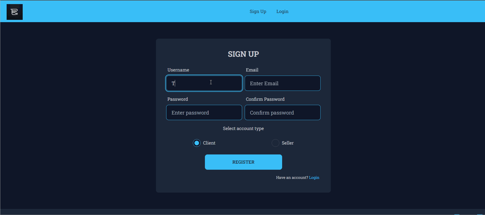
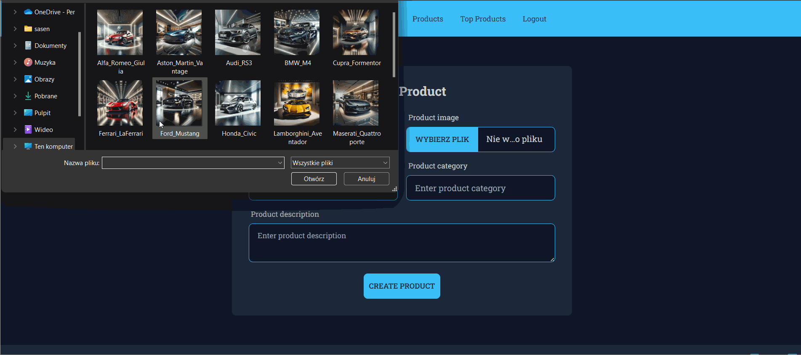
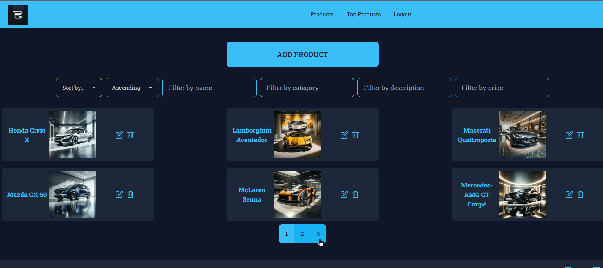
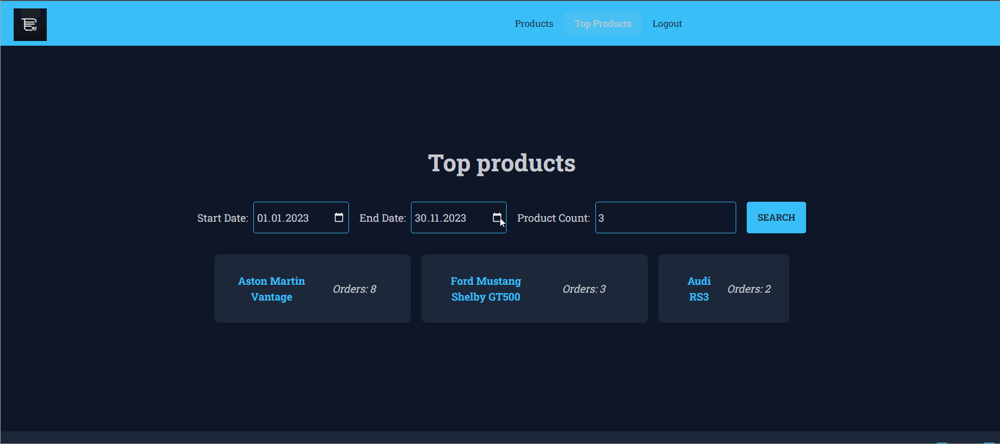
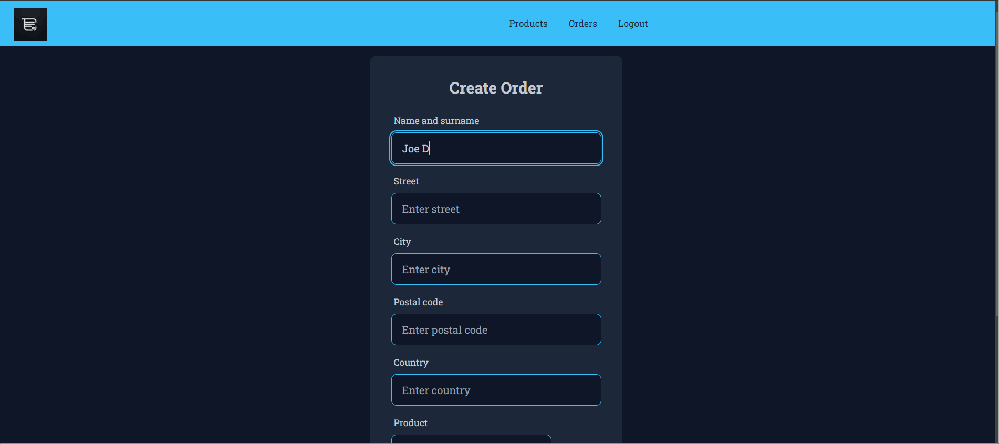
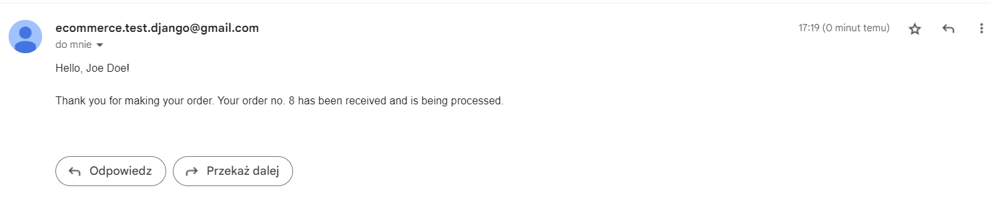
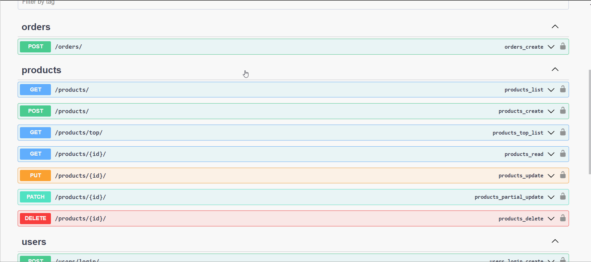

<div align="center">
<h1 align="center">E-Commerce</h1></div>


## Table of contents

* [General info](#general-info)
* [Technologies](#technologies)
* [Setup & Installation](#setup-&-installation)
* [Running The App](#running-the-app)
* [Viewing The App](#viewing-the-app)
* [Viewing The API Documentation](#viewing-the-api-documentation)
* [Features](#features)
* [Status](#status)
* [Contact](#contact)

## General info

E-commerce full-stack application is designed to deliver a seamless shopping experience, catering to both sellers and clients. The back-end functionality is powered by Django RestFramework, ensuring a robust and secure API, complete with Swagger-generated documentation for ease of navigation and interaction. The front-end interface is crafted using React with Next.js for optimized performance and styled with the sleek aesthetics of TailwindCSS and daisyUI. Sellers can effortlessly manage their products, with features like automatic thumbnail generation and analytics on popular items, while buyers enjoy a streamlined ordering process with automated email confirmations and reminders, all supported by the asynchronous task queue of Celery and Redis for background processing.

## Technologies

* Python 3.11.x
* Django 4.2.x
* Django REST framework 3.14.x
* Celery 5.3.x
* Redis 4.6.x
* SQLite3
* OpenAPI 2.0
* Node.js v18.17.x
* React 18.0.x
* Next.js 13.5.x
* TailwindCSS 3
* DaisyUI 3.9.x
* HTML5
* CSS3

## Setup & Installation

**Backend configuration**

Make sure you have the latest version of Python, pip and Redis installed

Clone the repository using the following command

```bash
git clone https://github.com/Gamattowicz/E-commerce
```

Move to the app directory

```bash
cd E-commerce
```

Create a virtual environment

```bash
python -m venv venv
```

Active the virtual environment

```bash
.\venv\Scripts\activate
```

Install all the project Requirements

```bash
pip install -r requirements.txt
```

Create an .env file to save your environment variables in main directory, where value after equal sign are your sensitive data that you have to fill in.
For instance:
SECRET_KEY = "your_unique_key"

```bash
SECRET_KEY = secret_key_name
EMAIL_HOST = email_host
EMAIL_HOST_USER = email_host_user
EMAIL_HOST_PASSWORD = email_host_password
```

Create your database

```bash
python manage.py makemigrations
```

```bash
python manage.py migrate
```

**Frontend configuration**

[Install Node.js](https://nodejs.org/en/) and Node Modules:

Move to directory ```frontend```.

```bash
cd frontend
```

Next install all dependencies.

```bash
npm install
```

## Running The App

In main directory run django web server:

```bash
python manage.py runserver
```

Move to directory ```frontend```.

```bash
cd frontend
```

Run the for development (the application is not currently designed for production):

```bash
npm run dev
```

Run Celery (Make sure that you are in the app directory and have activated virtual environment)

```bash
celery -A shop worker --loglevel=info --pool=eventlet

```

Run Redis (default port is setting as 6379)

```
redis-server
```

## Viewing The App

Go to `http://localhost:3000/`

## Viewing The API Documentation

Go to `http://127.0.0.1:8000/swagger/`
or `http://127.0.0.1:8000/redoc/`

## Features

* User management system with authentication and authorization and two account type (Client and Seller) +
* CRUD operations at products +
* Filtering, sorting and pagination for products +
* Display of the most frequently ordered products by Seller +
* Placing of orders by Customer
* Sending an e-mail to the customer confirming the order 
* Sending an email to the customer the day before the payment deadline with a reminder using Celery/Redis
* Automatic generation of documentation for the API using Swagger +

## Status

Basic structure of the project completed.

## Contact

Created by [@Gamattowicz](https://github.com/Gamattowicz) - feel free to contact me!
